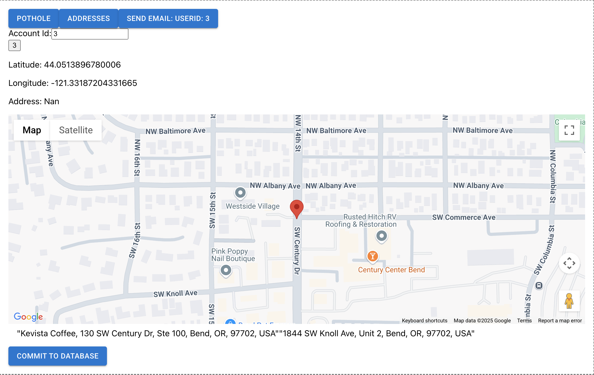
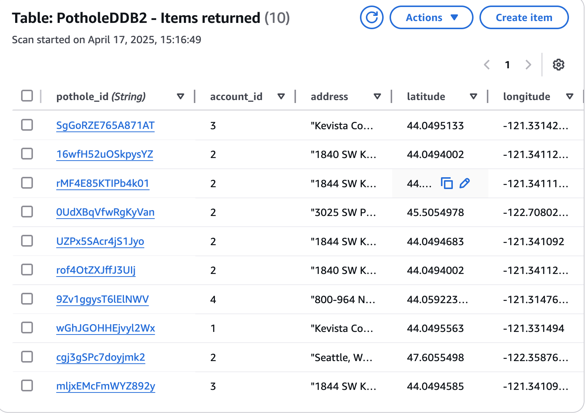
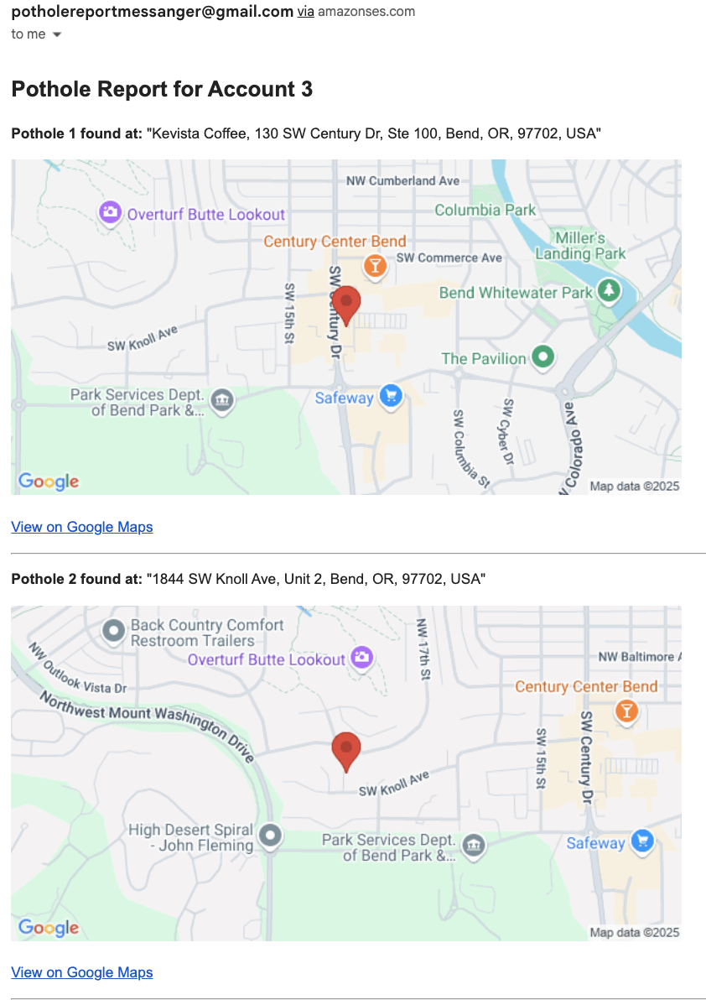
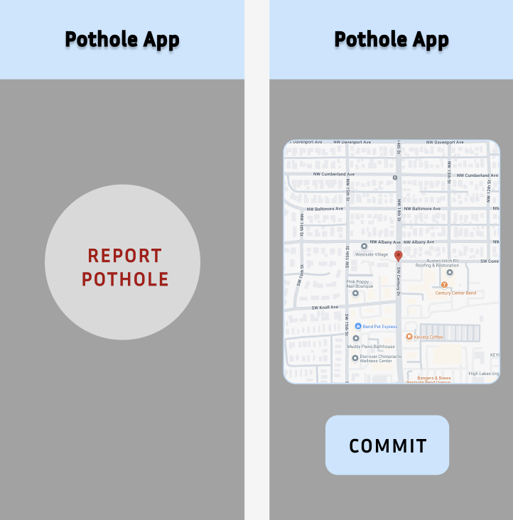

# Pothole Project

Most major cities provide an email portal to report potholes that simply require a location. As a commuter we encounter potholes all the time but when we get home, we often forget either where they were or to report them at all. Envisioned is a simple mobile app (phone, carplay, etc) connected to a service. To use the app, a button is pressed when driving past a pothole. The app notes the location, and sends it to the service. At some interval, the service accumulates all the pothole reports and generates a well formatted email to the local municipality, which include an address and map thumbnail of each pothole.

The purpose of this project is to build service for reporting and recording potholes that can be sent to the city for repair. Also included is a test-web application that for now takes the place of the enisioned mobile app frontend.

This project uses a client side gps plugin, the google maps api, AWS DynamoDB to store reported potholes, and AWS SES (simple email service) to send pothole data. The service also uses AWS ApiGateway, Lambda, IAM, and SAM.

To report potholes, the user will tap a button. GPS coordinates are then generated by the client and turned into a dynamic map interface through the Google Maps API. Using the map, the user is given the option to move a pin before committing the reported pothole to a database.

(working frontend)



When a user taps "Commit to Database", an address is generated from the map and saved to the database, along with a unique pothole_id, account_id, longitude, latitude, and time.



A list of potholes can be sent by AWS SWS (Simple Email Service) by user id.



## Development Goals

Currently there are some missing features that would be needed if this was to become a complete app.

- Accounts/Signin: Users should be able to sign in and have a unique user id. Currently, a user id exists but is user assigned, again for testing purposes. To correctly implement user id would require the use of a sign in page and a service like AWS Cognito.
- Mobile app: The current implementation uses a react-base locally hosted web page. This is useful for development and testing of the service. The mobile app should have a minimalistic user interface to work well with restrictions imposed by CarPlay.

  The diagram below shows the "Report Pothole" Button and Confirmation/Update Pages

  

- Finally, this project should have a feature that observes the database of collected potholes and groups them by proximity and time of reporting to generate a list. This list would be generated and sent to the city at the end of every week. This system would be an improvement over individual reporting as it would eliminate repeat reporting if the same pothole was reported by multiple users. This would increase the credibility of the service

# Setting Up

Find the file /js_stuff/gps-app/.env that contains the template:

REACT_APP_GOOGLE_MAPS_API_KEY=""

REACT_APP_REPORT_URL = “”

REACT_APP_EMAIL_URL = “”

REACT_APP_UPLOAD_URL = “

Fill in this file with the following infomation.

### Google Maps API Key

Go to [this link](https://developers.google.com/maps/documentation/embed/get-api-key) and follow the instructions on how to obtain a Google Maps API key. Once you have your google maps API key, copy and paste it in the .env file under REACT_APP_GOOGLE_MAPS_API_KEY and in handlers/generate_email.py under the GOOGLE_MAPS_API_KEY var.

### Deploy your service and collect AWS Invoke Url's

Must first deploy the pothole service in your AWS account.

1. Get an AWS account
2. See the [AWS SAM developer guide](https://docs.aws.amazon.com/serverless-application-model/latest/developerguide/what-is-sam.html) for an introduction to SAM specification, the SAM CLI, and serverless application concepts.
3. In the terminal in the top level directory, run “sam build ; sam deploy --region us-west-2”
4. Sign into the AWS console. In the API Gateway section under stages/prod there should be /generate_email, /generate_report, and /upload. In the console under each of these is /POST configuration which exposes an invoke URL. Copy and paste each invoke URL into the .env file.

### AWS Simple Email Service (SES)

Under /handlers/generate_email.py there are two email addresses (source and destination) that need to be added to the file and registered with SES.

- In the AWS console, navigate to the SES page. Under 'Configuration' navigate to 'identities' and select 'Create Identity'.
- Select 'Email Address' and follow the steps to register a source email.
- Repeat the last step for a destination email
- Paste both email addresses into /handlers/generate_email.py under DESTINATION_EMAIL and SOURCE_EMAIL.
- Save and run “sam build ; sam deploy --region us-west-2” again to update the lambda

# Running the Project

In the terminal navigate to js_stuff/gps-app and run the command "npm start". If your browser doesn't automatically open, open a brower to the provided local IP/Port.

## Cleanup

The application uses several AWS resources, including Lambda functions and an API Gateway API. These resources are defined in the `template.yaml` file in this project. You can update the template to add AWS resources through the same deployment process that updates application code.

To delete the sample application that you created, use the AWS CLI. Assuming you used your project name for the stack name, you can run the following:

```bash
sam delete --stack-name "pothole"
```
